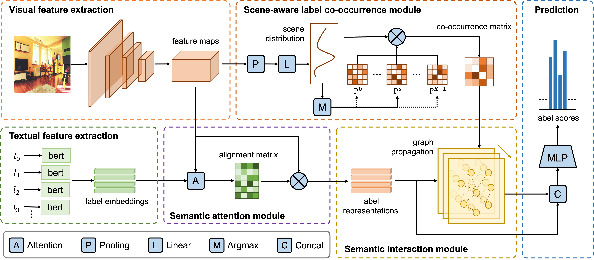

## Scene-Aware Label Graph Learning for Multi-Label Image Classification

### Introduction
This is an official PyTorch implementation of Scene-Aware Label Graph Learning for Multi-Label Image Classification [[paper]](https://openaccess.thecvf.com/content/ICCV2023/papers/Zhu_Scene-Aware_Label_Graph_Learning_for_Multi-Label_Image_Classification_ICCV_2023_paper.pdf).




### Data Preparation
1. Download dataset and organize them as follow:
```
|datasets
|---- MSCOCO
|-------- annotations
|-------- train2014
|-------- val2014
|---- NUS-WIDE
|-------- Flickr
|-------- Groundtruth
|-------- ImageList
|-------- NUS_WID_Tags
|-------- Concepts81.txt
|---- VOC2007
|-------- Annotations
|-------- ImageSets
|-------- JPEGImages
|-------- SegmentationClass
|-------- SegmentationObject
```
2. Preprocess using following commands:
```bash
python scripts/mscoco.py
python scripts/nuswide.py
python scripts/voc2007.py
python embedding.py --data [mscoco, nuswide, voc2007]
```

### Requirements
```
torch >= 1.9.0
torchvision >= 0.10.0
```

### Evaluation
Pre-trained weights can be found in [google drive](https://drive.google.com/drive/folders/1Ys3c5a19Mg_PguDn5F2fKKnAFNx93uLX?usp=sharing). Download and put them in the `experiments` folder, then one can use follow commands to reproduce results reported in paper.
```bash
python evaluate.py --exp-dir experiments/salgl_resnet101_mscoco/exp3     # Microsoft COCO (448 x 448)
python evaluate.py --exp-dir experiments/salgl_resnet101_mscoco/exp6     # Microsoft COCO (576 x 576)
python evaluate.py --exp-dir experiments/salgl_resnet101_nuswide/exp2    # NUS-WIDE
python evaluate.py --exp-dir experiments/salgl_vit_large_patch16_224_mscoco/exp1     # Pascal VOC 2007
```

### Visualization
To visualize the word cloud and the label co-occurrence probability heatmap of different scene categories, please first download coco experiments (salgl_resnet101_mscoco) and then run following commands:
```bash
python labelcloud.py --exp-dir experiments/salgl_resnet101_mscoco/exp3
python heatmap.py --exp-dir experiments/salgl_resnet101_mscoco/exp3
```